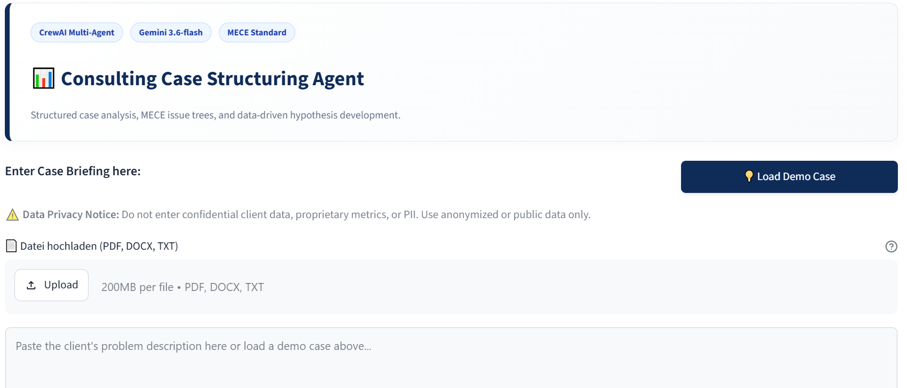
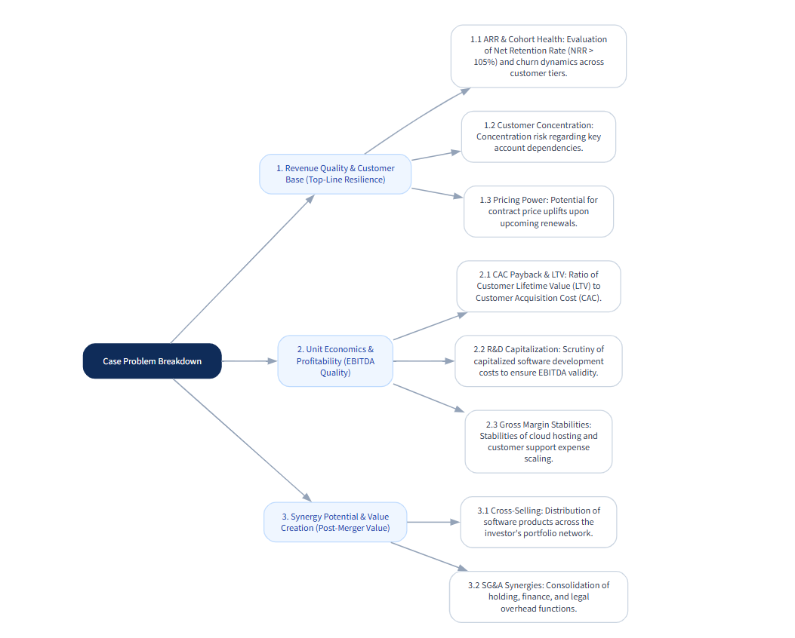
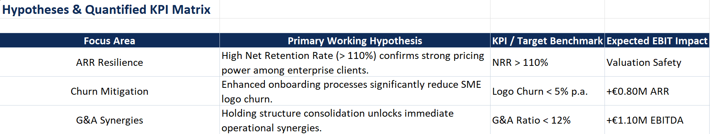
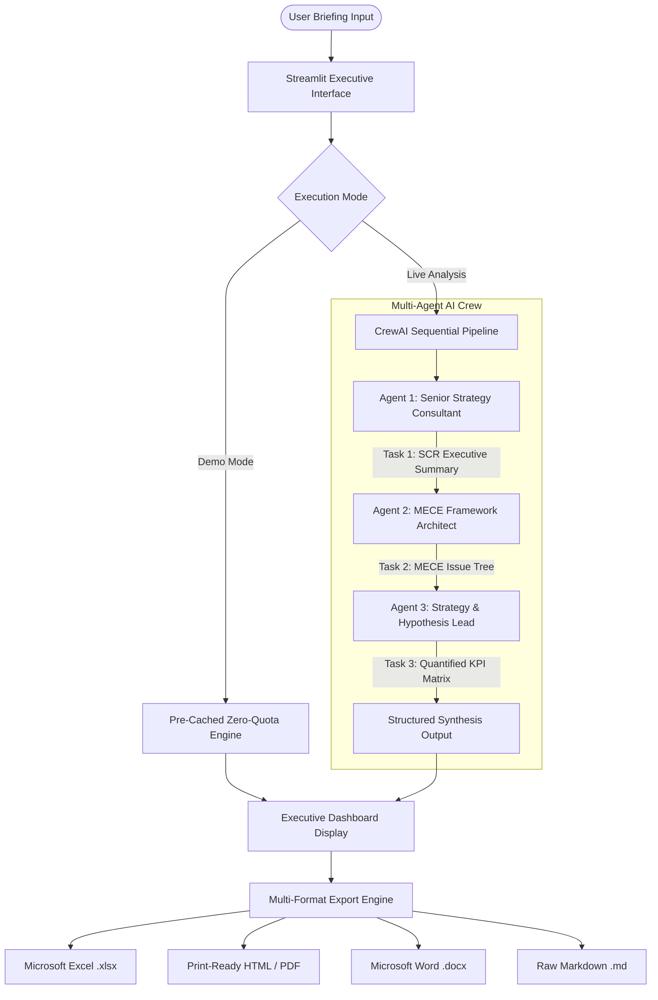

# 📊 Consulting Case Structuring Agent

An enterprise-grade, multi-agent AI system designed to automate strategic problem breakdown, MECE issue trees, and hypothesis-driven KPI matrix development for management consulting, private equity, and corporate finance cases.

---

## 🎯 Executive Summary & Core Value Proposition

In top-tier management consulting and M&A advisory, structuring complex client problems rapidly and logically is critical. The **Consulting Case Structuring Agent** leverages a sequential multi-agent AI crew to transform raw corporate briefings into actionable advisory deliverables within seconds.

* **Methodological Rigor:** Enforces strict consulting standards including **Situation-Complication-Resolution (SCR)** frameworks and **Mutually Exclusive, Collectively Exhaustive (MECE)** issue trees.
* **Dual-Execution Pipeline:** Features a live multi-agent execution engine via **CrewAI & Gemini 3.6-flash** alongside a zero-quota pre-cached preview mode for instant, quota-safe demonstrations.
* **C-Level Deliverable Export:** Generates client-ready deliverables formatted for executive presentation in **Microsoft Excel (.xlsx)**, **HTML (A4 print-optimized)**, **Microsoft Word (.docx)** with native grid tables, and **Raw Markdown (.md)**.

---

## 📸 Application Showcase

| Interactive Graphviz MECE Tree | Automated Excel Matrix Deliverable (.xlsx) |
| :---: | :---: |
|  |  |

---

## 🏗️ System Architecture & Workflow

The platform operates on a sequential three-agent workflow coordinated through CrewAI. Context and task outputs are dynamically passed downstream to build a cohesive strategic synthesis.

---

## 🛠️ Key Technical & Architectural Challenges Solved

- **API Quota Resilience & Zero-Downtime Demos:** Engineered a hybrid execution engine. To prevent API rate-limit errors (HTTP 429) during live recruiter evaluations, standard case studies leverage pre-cached, fully-structured benchmark responses, automatically falling back to live LLM execution upon custom input.
- **Robust Data Sanitization & Grid Exporting:** Built a custom regex-parsing pipeline to clean LLM-generated Markdown artifacts (e.g., bolding, bullet points, raw symbols) before dynamically constructing native, styled `openpyxl` Excel grids and `python-docx` elements.
- **Print-Precision C-Level Formatting:** Designed an HTML/CSS print framework using modern `@page` media rules and page-break rules, ensuring exact A4 boundaries and seamless PDF generation for board-level reporting.